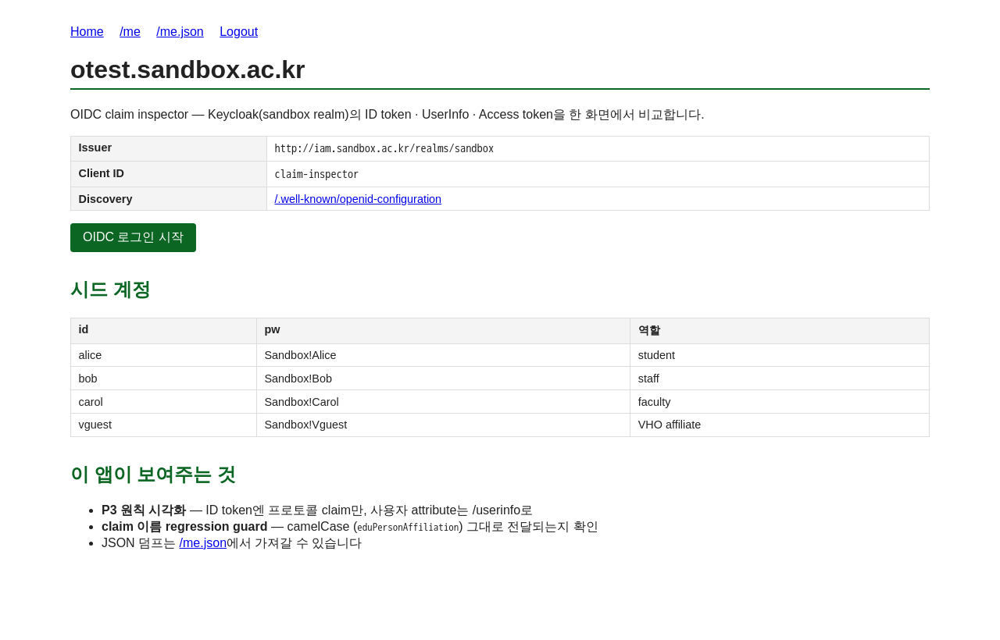
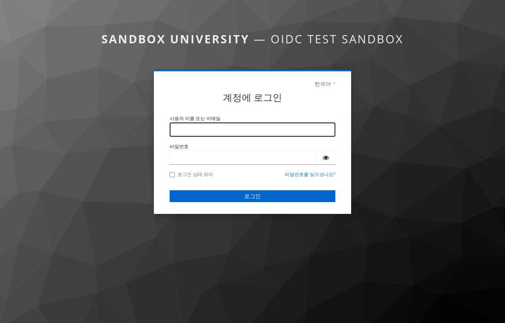
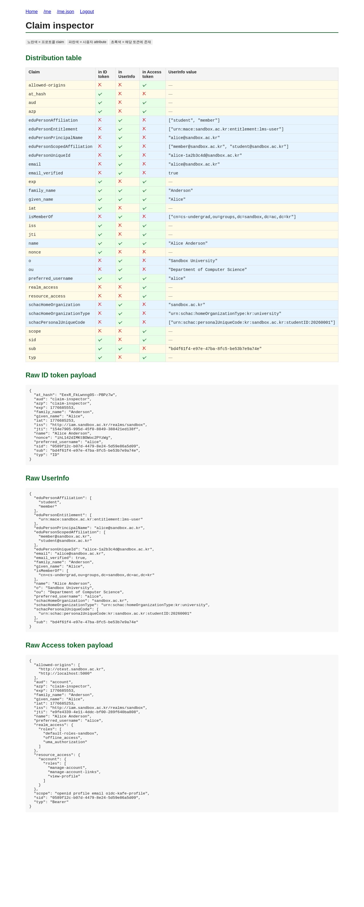
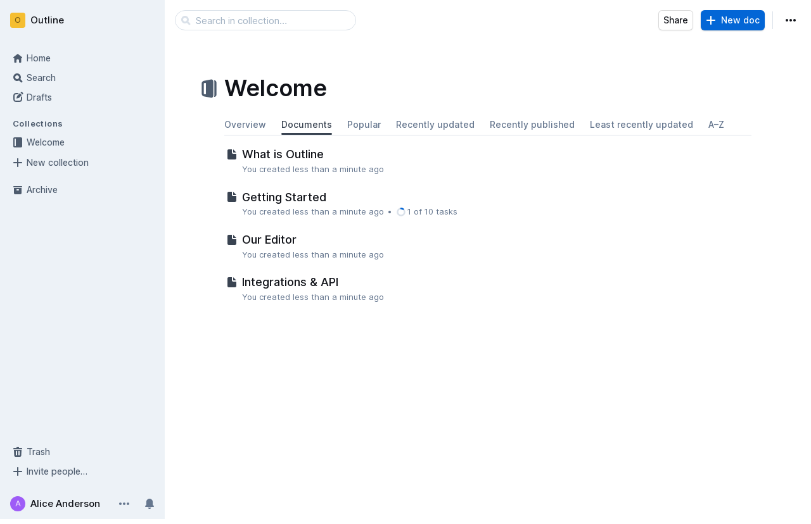
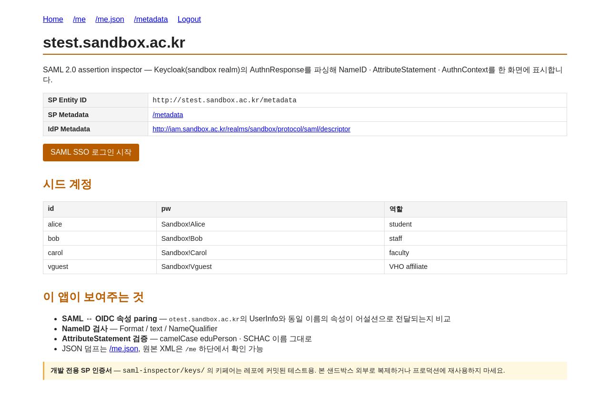
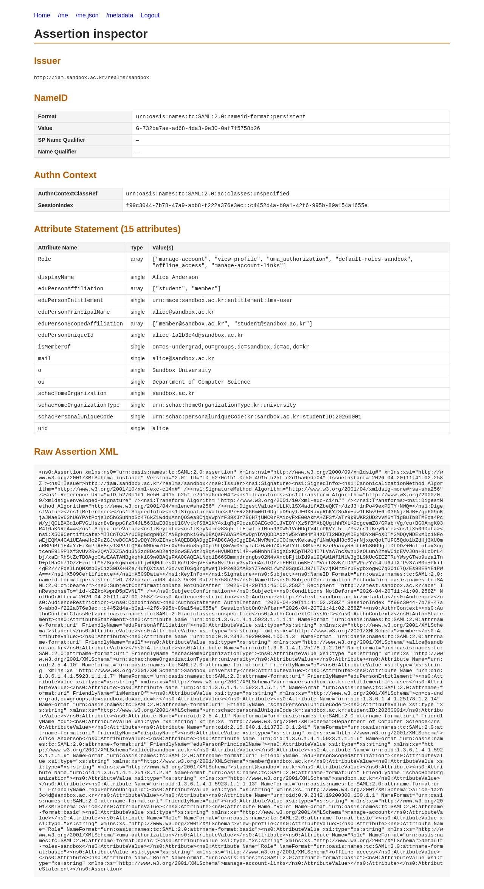
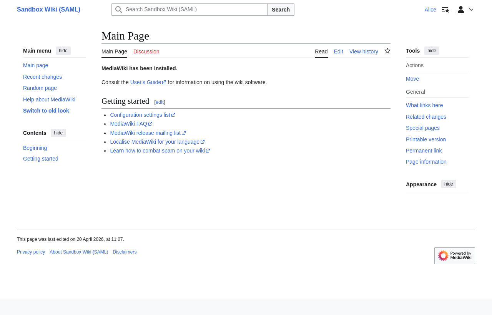

# KAFE Test Sandbox 🛡️

**로컬에서 [KAFE](https://www.kafe.or.kr) 연동을 미리 검증할 수 있는 샌드박스** 입니다. `docker compose up -d` 한 번으로 Keycloak 기반 가상 IdP가 실행되고, KAFE와 동일한 claim/attribute 이름과 분배 정책으로 토큰과 어설션을 발급합니다. 도메인·계정·클라이언트 시크릿이 모두 고정되어 있어 pytest, Playwright 등으로 자동화 테스트를 붙이기도 쉽습니다.

이 샌드박스는 **OIDC와 SAML 2.0 두 프로토콜**을 한 Keycloak realm에서 동시에 제공합니다. `iam.sandbox.ac.kr` 하나가 양쪽 IdP 역할을 하고, OIDC 쪽(`o*.`) · SAML 쪽(`s*.`) 각각 참조용 SP 두 대씩 (디버깅용 Inspector + 실제 위키 예제) 동봉되어 있어 동일한 사용자·동일한 속성이 두 프로토콜에서 어떻게 다르게 전달되는지 비교 학습이 가능합니다.

- **OIDC 가이드** → [`docs/oidc.md`](docs/oidc.md)
- **SAML 가이드** → [`docs/saml.md`](docs/saml.md)

## 1. 하위도메인 컨벤션

앱 역할이 한눈에 드러나도록 서브도메인 앞 글자로 프로토콜을 구분합니다.

| 접두 | 의미 | 예시 |
|---|---|---|
| `iam.` | IdP (OIDC OP + SAML IdP, 공용) | `iam.sandbox.ac.kr` |
| `o*.` | OIDC 프로파일용 앱 | `otest.`, `owiki.` |
| `s*.` | SAML 프로파일용 앱 | `stest.`, `swiki.` |

## 2. 시스템 구성

**⚠️ 도메인 주의**: 로컬의 `/etc/hosts` 를 수정하여 `sandbox.ac.kr` 도메인을 로컬로 매핑해야 정상 작동합니다.

| 컨테이너 | SW | 도메인 | 프로토콜 | 역할 |
|---|---|---|---|---|
| `iam-app` | [Keycloak](https://www.keycloak.org) | `iam.sandbox.ac.kr` | OIDC + SAML | **IdP** |
| `otest-app` | Flask + authlib | `otest.sandbox.ac.kr` | OIDC | **Claim Inspector** (OIDC 토큰·userinfo 디버깅) |
| `owiki-app` | [Outline](https://www.getoutline.com) | `owiki.sandbox.ac.kr` | OIDC | **SP** (위키 예제) |
| `stest-app` | Flask + pysaml2 | `stest.sandbox.ac.kr` | SAML | **Assertion Inspector** (SAML 어설션 디버깅) |
| `swiki-app` | [MediaWiki](https://www.mediawiki.org) + `mod_shib`/`shibd` + `Auth_remoteuser` | `swiki.sandbox.ac.kr` | SAML | **SP** (위키 예제, Shibboleth) |
| `nginx` | Nginx | (공용) | — | 리버스 프록시 |

## 3. 빠른 시작

### 3.1. hosts 등록 (최초 1회)

```bash
sudo ./scripts/bootstrap-hosts.sh
```
`127.0.0.1` → `iam.sandbox.ac.kr`, `otest.sandbox.ac.kr`, `owiki.sandbox.ac.kr`, `stest.sandbox.ac.kr`, `swiki.sandbox.ac.kr` 매핑 추가.

### 3.2. 서비스 기동

```bash
docker compose up -d
```
모든 컨테이너(IdP, 두 Inspector, 두 위키 예제, Nginx)가 `healthy` 상태가 될 때까지 약 1~2분 정도 소요됩니다.

### 3.3. 작동 확인

- **Keycloak 관리자**: http://iam.sandbox.ac.kr/ — `admin` / `admin`
- **OIDC Claim Inspector**: http://otest.sandbox.ac.kr/ → `Login` → 테스트 계정 선택
- **OIDC Wiki (Outline)**: http://owiki.sandbox.ac.kr/
- **SAML Assertion Inspector**: http://stest.sandbox.ac.kr/ → `SAML SSO 로그인 시작`
- **SAML Wiki (MediaWiki + Shibboleth SP)**: http://swiki.sandbox.ac.kr/wiki/Special:UserLogin → Keycloak로그인 → alice가 자동 프로비저닝되어 MediaWiki 상단 우측 유저 링크에 표시됨

예상 결과 (클릭 시 원본):

<p>
  <a href="docs/screenshots/01-otest-oidc-main.png"></a>
  <a href="docs/screenshots/02-keycloak-login.png"></a>
  <a href="docs/screenshots/03-otest-oidc-claim-inspector.png"></a>
  <a href="docs/screenshots/04-owiki-logged-in.png"></a>
  <a href="docs/screenshots/05-stest-saml-main.png"></a>
  <a href="docs/screenshots/06-stest-saml-assertion.png"></a>
  <a href="docs/screenshots/07-swiki-logged-in.png"></a>
</p>

> 스크린샷은 Playwright로 자동 재생성 가능: `docker compose --profile screenshots run --rm screenshots` (소스는 `screenshots/capture.py`).

## 4. 테스트 계정

모든 계정의 조직(`schacHomeOrganization`)은 `sandbox.ac.kr`로 설정되어 있습니다.

| ID | Password | 역할 | eduPersonAffiliation |
|---|---|---|---|
| alice  | `Sandbox!Alice`  | 학생 | `member`, `student` |
| bob    | `Sandbox!Bob`    | 직원 | `member`, `employee`, `staff` |
| carol  | `Sandbox!Carol`  | 교수 | `member`, `employee`, `faculty` |
| vguest | `Sandbox!Vguest` | 방문객 | `affiliate` |

## 5. 프로젝트 구조

```text
./
├── keycloak/         # Realm, User, Mapper 설정 (Single Source of Truth)
├── nginx/            # 리버스 프록시
├── claim-inspector/  # otest-app 소스 (Flask 기반 OIDC 디버깅 도구)
├── saml-inspector/   # stest-app 소스 (Flask + pysaml2 SAML SP, SP 키페어 포함)
├── swiki/            # swiki-app 소스 (MediaWiki + Shibboleth SP + Auth_remoteuser)
├── tests/            # pytest 기반 정합성 검증 스위트 (OIDC + SAML)
├── screenshots/      # Playwright 기반 스크린샷 자동화
├── scripts/          # 각종 유틸리티 스크립트
└── docs/             # OIDC · SAML 레퍼런스 + 스크린샷 모음
```

## 6. 참고 스펙

실제 연합 등록에 쓸 메타데이터(KAFE IdP 등록 페이로드, REFEDS OIDC Federation entity statement 등)는 본 샌드박스가 서빙하지 않습니다. 각 연합의 공식 문서를 직접 참조하세요.

- **KAFE** — https://www.kafe.or.kr
- **REFEDS** — https://refeds.org
- **REFEDS SAML↔OIDC 매핑** — https://github.com/surfnet-niels/refeds-oidcre-saml-oidc-mapping

## 라이선스

MIT License. 본 샌드박스의 계정 및 도메인 정보는 모두 가상의 데이터입니다.
