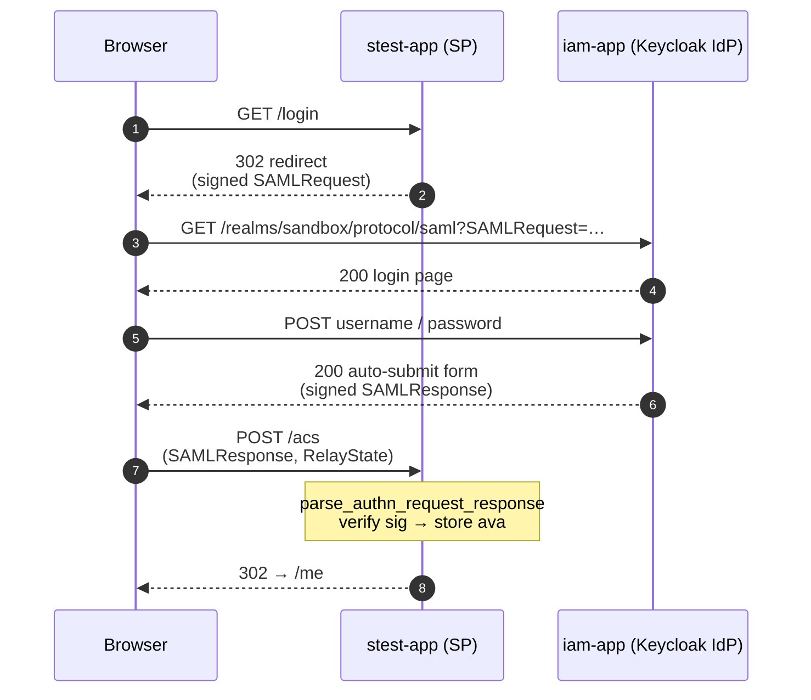

# SAML Reference

샌드박스 Keycloak이 발급하는 SAML 2.0 어설션의 **엔드포인트 · 속성 이름 · 분배 위치**를 한 곳에 모은 레퍼런스. OIDC 쪽은 [`oidc.md`](oidc.md) 참조.

- **이름 규약**: FriendlyName=camelCase(REFEDS), Name=REFEDS OID under `urn:oasis:names:tc:SAML:2.0:attrname-format:uri`. pysaml2/SSP 등 성숙한 SP는 FriendlyName으로 접근 가능.
- **분배 원칙**: SAML에는 OIDC의 back-channel userinfo 상당물이 없으므로 **어설션 = 풀셋**. 대신 **NameID는 `persistent` pairwise**로 해 RP 간 linkability를 줄인다.
- **출처 scope**: `saml-kafe-profile` 클라이언트 스코프 하나에 15개 속성 매퍼가 집중되어 있음 (`keycloak/import.json`).

## 핵심 개념

SAML 2.0 을 앱에 붙이는 방법은 크게 **두 가지**가 있습니다. 이 샌드박스는 두 방식을 각각 `stest` · `swiki` 로 병치해 비교 학습이 가능합니다.

| 통합 방식 | 예시 SP | 특징 | 장점 | 단점 |
|---|---|---|---|---|
| **앱 내 라이브러리** | `stest-app` (Flask + [pysaml2](https://pysaml2.readthedocs.io)) | SAML 처리 코드가 앱 프로세스 안에서 동작 | 단순·가벼움, 어설션 내용을 앱에서 직접 열람 가능 | 앱이 자체 세션을 가진 경우 (MediaWiki 등) SAML 라이브러리 세션과 충돌 위험 |
| **웹서버 레이어 (Shibboleth)** | `swiki-app` (MediaWiki + [`mod_shib`](https://shibboleth.atlassian.net/wiki/spaces/SP3) + `shibd`) | Apache의 mod_shib 이 SAML 을 처리하고 앱에는 `REMOTE_USER` / `Shib-*` 환경변수로만 전달 | 앱 세션과 완전 독립, 동일 SP 뒤에 여러 앱 프록시 가능, 대부분의 KAFE 기관이 사용 중인 구조 | Apache 필요, 컨테이너 무거움, 설정 파일 많음 |

두 구현의 더 세밀한 비교 — 세션 모델 / 앱 전달 방식 / 현실 대응 — 는 이 문서 하단 ["두 SP의 구현 차이"](#두-sp의-구현-차이--교육적-대비) 섹션 참고.

공통적으로 SAML SP 는 다음이 필요합니다.

* **SP X.509 인증서**: SP 가 IdP 로 보내는 AuthnRequest 를 서명하고 어설션의 수신자임을 증명하기 위해 자체서명(또는 연합 발급) 키페어. 이 샌드박스는 **개발용** 키페어를 레포에 커밋:
    - `saml-inspector/keys/sp.crt` · `sp.key` — stest 용 (AuthnRequest 서명 활성)
    - `swiki/shib-keys/sp-cert.pem` · `sp-key.pem` — swiki 용 (샌드박스에선 AuthnRequest 서명 끔)

    상세는 하단 "키/서명" 섹션 + [`../saml-inspector/keys/README.md`](../saml-inspector/keys/README.md) 참조.
* **IdP 에 SP 등록**: SP 공개 인증서를 Keycloak SAML 클라이언트 정의에 박아둬야 서명 검증이 가능. `keycloak/import.json` 의 해당 SAML 클라이언트 `attributes.saml.signing.certificate` 속성. SP 키를 교체하면 이 값도 같이 갱신 필요.
* **`saml-kafe-profile`**: OIDC 의 `oidc-kafe-profile` 과 대칭 관계에 있는 SAML 클라이언트 스코프. 같은 속성 집합 (eduPerson·SCHAC 등) 을 URI NameFormat + REFEDS OID + camelCase FriendlyName 으로 발급.
* **SAML Assertion Inspector (`stest-app`)**: 어설션 원본 XML · NameID · AttributeStatement 를 한 화면에서 열람하는 디버깅 도구 — http://stest.sandbox.ac.kr/ .

## 엔드포인트

| 용도 | URL | 비고 |
|---|---|---|
| IdP 메타데이터 | `http://iam.sandbox.ac.kr/realms/sandbox/protocol/saml/descriptor` | 공개, SP가 등록 시 import |
| SSO (HTTP-POST / HTTP-Redirect) | `http://iam.sandbox.ac.kr/realms/sandbox/protocol/saml` | 바인딩은 요청 form/쿼리로 구분 |
| SLO | `http://iam.sandbox.ac.kr/realms/sandbox/protocol/saml` | Front-channel HTTP-Redirect |
| stest-app SP 메타데이터 | `http://stest.sandbox.ac.kr/metadata` | 참조용 |
| stest-app ACS (POST) | `http://stest.sandbox.ac.kr/acs` | |
| stest-app SLO (Redirect) | `http://stest.sandbox.ac.kr/slo` | |
| swiki-app SP 메타데이터 | `http://swiki.sandbox.ac.kr/Shibboleth.sso/Metadata` | Shibboleth SP(mod_shib) |
| swiki-app ACS (POST) | `http://swiki.sandbox.ac.kr/Shibboleth.sso/SAML2/POST` | |
| swiki-app Shib Session (디버그) | `http://swiki.sandbox.ac.kr/Shibboleth.sso/Session?showAttributeValues=true` | 현재 Shib 세션의 속성 덤프 |

## SP-initiated SSO 플로우

## 전체 attribute 분배 표

샌드박스는 OIDC와 동일한 사용자 속성 집합을 SAML 어설션의 `AttributeStatement`로 1회성으로 전달한다. REFEDS/KAFE 호환을 위해 OID 기반 Name + camelCase FriendlyName을 병기한다.

| User Attribute | FriendlyName | Name (`urn:oid:…`) | Multivalued | NameID? |
|---|---|---|:-:|:-:|
| `uid` | `uid` | `0.9.2342.19200300.100.1.1` | no | — |
| `displayName` | `displayName` | `2.16.840.1.113730.3.1.241` | no | — |
| `email` | `mail` | `0.9.2342.19200300.100.1.3` | no | — |
| `eduPersonPrincipalName` | `eduPersonPrincipalName` | `1.3.6.1.4.1.5923.1.1.1.6` | no | — |
| `eduPersonUniqueId` | `eduPersonUniqueId` | `1.3.6.1.4.1.5923.1.1.1.13` | no | — |
| `eduPersonAffiliation` | `eduPersonAffiliation` | `1.3.6.1.4.1.5923.1.1.1.1` | **yes** | — |
| `eduPersonScopedAffiliation` | `eduPersonScopedAffiliation` | `1.3.6.1.4.1.5923.1.1.1.9` | **yes** | — |
| `eduPersonEntitlement` | `eduPersonEntitlement` | `1.3.6.1.4.1.5923.1.1.1.7` | **yes** | — |
| `eduPersonOrcid` | `eduPersonOrcid` | `1.3.6.1.4.1.5923.1.1.1.16` | no | — |
| `schacHomeOrganization` | `schacHomeOrganization` | `1.3.6.1.4.1.25178.1.2.9` | no | — |
| `schacHomeOrganizationType` | `schacHomeOrganizationType` | `1.3.6.1.4.1.25178.1.2.10` | no | — |
| `schacPersonalUniqueCode` | `schacPersonalUniqueCode` | `1.3.6.1.4.1.25178.1.2.14` | **yes** | — |
| `o` | `o` | `2.5.4.10` | no | — |
| `ou` | `ou` | `2.5.4.11` | no | — |
| `isMemberOf` | `isMemberOf` | `1.3.6.1.4.1.5923.1.5.1.1` | **yes** | — |
| (Keycloak 생성 pairwise UUID) | — | — | — | **NameID** (`persistent`) |

## NameID 정책

- Format: `urn:oasis:names:tc:SAML:2.0:nameid-format:persistent`
- SP별 pairwise: Keycloak이 (user, client) 쌍마다 고유 UUID를 생성하여 저장. SP 간에 주체 연결 추적 불가.
- Transient/email/username 필요 시 SP별로 `saml_name_id_format` attribute를 변경 (`keycloak/import.json`의 SAML 클라이언트 블록).

## REFEDS 매핑 참고사항

이 샌드박스는 [REFEDS OIDCre 초안](https://github.com/surfnet-niels/refeds-oidcre-saml-oidc-mapping)의 매핑 지침을 따른다. OIDC 쪽 `oidc-kafe-profile`과 SAML 쪽 `saml-kafe-profile`은 같은 속성 집합을 동일한 이름(camelCase)으로 발급해 `otest-app` ↔ `stest-app` 비교가 가능하다.

**Orphaned SAML attributes**: REFEDS 2017 위키의 "Orphaned SAML attributes" 섹션에서 OIDC 표준 claim 대응이 없다고 분류된 속성 (`eduPersonAffiliation`, `eduPersonScopedAffiliation`, `eduPersonEntitlement`, `uid`, `isMemberOf` 등)은 SAML에서는 자연스럽게 존재하므로 **SAML 쪽이 원본, OIDC 쪽이 "REFEDS/KAFE가 camelCase 그대로 커스텀 claim으로 노출"하는 구조**임을 염두에 두자. [`oidc.md`](oidc.md)의 주석과 대응.

## 새 SAML SP 추가하기

1. SP의 `EntityDescriptor` 메타데이터를 확보. pysaml2/SSP 기반이라면 SP가 `/metadata`를 서빙하므로 URL로 충분.
2. `keycloak/import.json`의 `clients` 배열에 새 블록 추가. `stest-app` 블록을 복제하여 `clientId`, `redirectUris`, `saml.signing.certificate`, `saml_assertion_consumer_url_post`, `saml_single_logout_service_url_redirect` 만 교체.
3. `defaultClientScopes`에 `saml-kafe-profile` 포함.
4. `./scripts/reset.sh && docker compose up -d` 로 realm 재임포트.
5. 스모크: `tests/test_saml_attributes.py`를 복제하여 새 SP 대상으로 돌려 확인.

## 키/서명

`stest-app`은 `saml-inspector/keys/sp.crt`, `sp.key`의 자체서명 인증서로 AuthnRequest를 서명한다. `keycloak/import.json`의 `saml.signing.certificate`에 동일 공개인증서 base64가 박혀 있어 Keycloak이 서명을 검증한다.

**경고**: 이 키는 레포에 커밋되어 공개되어 있음. 샌드박스 용도 외 재사용 금지. 교체 절차는 [`saml-inspector/keys/README.md`](../saml-inspector/keys/README.md) 참조.

## 두 SP의 구현 차이 — 교육적 대비

이 샌드박스는 같은 Keycloak IdP를 대상으로 **두 개의 서로 다른 SAML SP 구현**을 병치한다.

| 항목 | `stest-app` | `swiki-app` |
|---|---|---|
| SP 구현 | Flask + [pysaml2](https://pysaml2.readthedocs.io) (Python 라이브러리) | [Shibboleth SP](https://shibboleth.atlassian.net/wiki/spaces/SP3) (`shibd` 데몬 + Apache `mod_shib`) |
| SAML 처리 레이어 | 앱 내부(PHP/Python 프로세스) | 웹서버 레이어(별도 데몬) |
| 앱 전달 방식 | `Saml2Client.parse_authn_request_response(...).ava` 딕셔너리 | Apache 환경변수 (`REMOTE_USER`, `Shib-*`, `eduPersonPrincipalName` 등) |
| 세션 모델 | Flask 세션 | Shibboleth SP 세션 + 앱 세션 분리 |
| 장점 | 단순, 디버깅 용이, 어설션 원본 XML 열람 가능 | 앱 세션과 독립 — MediaWiki처럼 자체 세션을 가진 앱과 공존 문제 없음 |
| 현실 대응 | SSP/OIDC-style R&E 서비스 | KAFE 기관의 주류 레퍼런스 스택 |

KAFE 기관 대부분은 Shibboleth를 운영하므로 **실제 연동 검증은 `swiki` 쪽이 현실에 가깝다**. stest는 어설션 내부를 눈으로 보며 학습하는 용도로 더 적합.

## 관련 파일

- `keycloak/import.json` — `saml-kafe-profile` 스코프 + 두 SAML 클라이언트 (`http://stest.sandbox.ac.kr/metadata`, `http://swiki.sandbox.ac.kr/shibboleth`)
- `saml-inspector/app.py` — `stest-app`. pysaml2로 어설션 파싱 후 `ava` 세션에 저장
- `saml-inspector/templates/me.html` — NameID/AttributeStatement/원본 XML을 표로 렌더
- `swiki/shib-config/shibboleth2.xml` — Shibboleth SP 설정. IdP 메타데이터 URL, entityID, Session handler
- `swiki/shib-config/attribute-map.xml` — OID → FriendlyName 매핑. `saml-kafe-profile`과 1:1 대응
- `swiki/LocalSettings.php` — MediaWiki `Auth_remoteuser` 설정으로 `$_SERVER['REMOTE_USER']` 신뢰
- `tests/test_saml_metadata.py` — IdP/SP 메타데이터 shape 회귀
- `tests/test_saml_attributes.py` — alice로 stest SP-initiated SSO → 어설션 속성 회귀
- `tests/test_swiki_shibboleth.py` — alice로 swiki 로그인 → Shibboleth 세션 속성 + MediaWiki 사용자 자동생성 회귀
